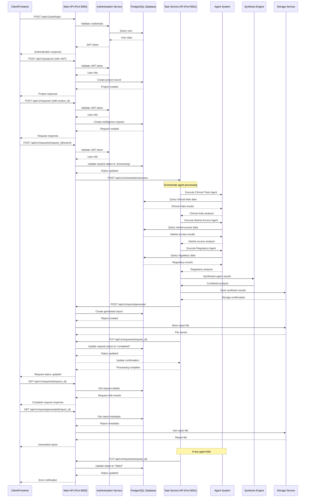

# Pharmaceutical CI Platform - Project to Request to Response Flow

## Complete Workflow Sequence Diagram

## Key Components in the Flow

### 1. **Authentication Layer**
- JWT-based authentication
- User validation for all requests
- Session management

### 2. **Project Management**
- Create, read, update, delete projects
- Project statistics and metadata
- User-specific project isolation

### 3. **Intelligence Request Processing**
- Request creation with project association
- Status tracking (draft → processing → completed/failed)
- Agent orchestration triggers

### 4. **Agent System**
- **Clinical Trials Agent**: Analyzes clinical trial data
- **Market Access Agent**: Processes market access information
- **Regulatory Agent**: Handles regulatory compliance data
- **Synthesis Agent**: Combines all agent results

### 5. **Synthesis Engine**
- Cross-agent data correlation
- Intelligence synthesis
- Report generation

### 6. **Storage Service**
- File storage for reports
- Data persistence
- Retrieval mechanisms

### 7. **Response Generation**
- Structured report creation
- Multiple format support (PDF, JSON, etc.)
- Status tracking and notifications

## API Endpoints Used

### Main API (Port 8000)
- `POST /api/v1/auth/login` - Authentication
- `POST /api/v1/projects/` - Create project
- `POST /api/v1/requests/` - Create intelligence request
- `POST /api/v1/requests/{id}/submit` - Submit for processing
- `GET /api/v1/requests/{id}` - Get request status
- `POST /api/v1/reports/generate/` - Generate report
- `GET /api/v1/reports/generated/{id}` - Get generated report

### Task Service API (Port 8001)
- `POST /api/v1/orchestration/process` - Process request
- `GET /api/v1/agents/` - Get available agents
- `POST /api/v1/synthesis/` - Synthesize results

## Status Flow
1. **Draft** → Request created but not submitted
2. **Processing** → Submitted and being processed by agents
3. **Completed** → All agents completed, report generated
4. **Failed** → Error occurred during processing

## Error Handling
- Database connection failures
- Agent execution errors
- Storage service failures
- Authentication/authorization errors
- Network timeouts

This flow ensures a complete end-to-end processing pipeline from project creation through intelligence gathering to final report delivery. 
