# User Creation Workflow - Complete Sequence Diagrams

## 📋 **Overview**

This document provides comprehensive sequence diagrams for the user creation process in the Pharmaceutical CI Platform, covering all phases from API call to backend processing. The diagrams are designed for developers with ~2 years of experience and match the actual codebase logic.

## 🎯 **Identified Flows**

Based on codebase analysis, the following distinct flows have been identified:

1. **User Registration Flow** - New user creation with validation
2. **User Login Flow** - Authentication and JWT token generation
3. **User Profile Management Flow** - Get/update user information
4. **Error Handling Flows** - Various error scenarios
5. **Database Seeding Flow** - Initial user creation during setup
6. **Authentication Middleware Flow** - Token validation for protected endpoints

---

## 🔄 **1. User Registration Flow**

### **Main Registration Sequence**

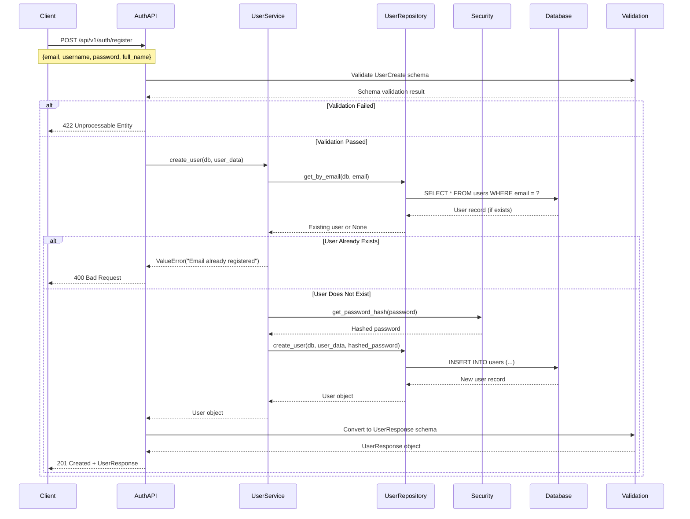

### **Registration Error Scenarios**

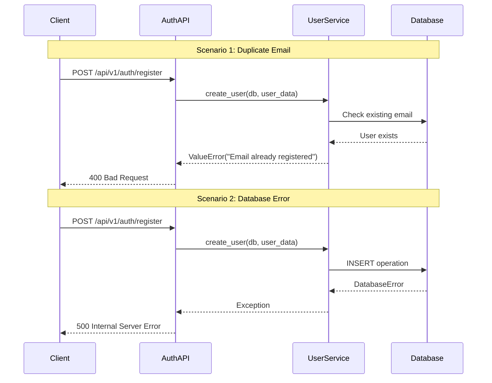

---

## 🔐 **2. User Login Flow**

### **Successful Login Sequence**

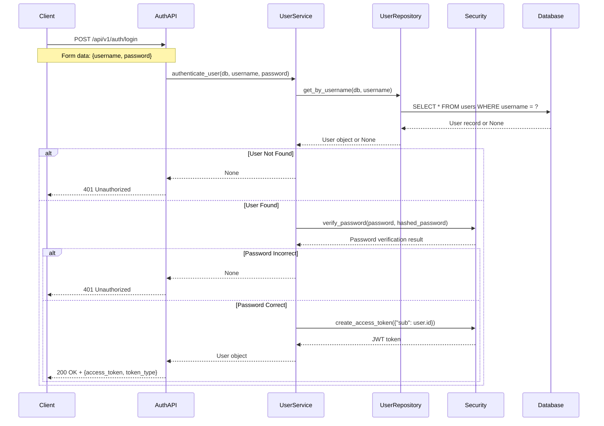

### **Login Error Scenarios**

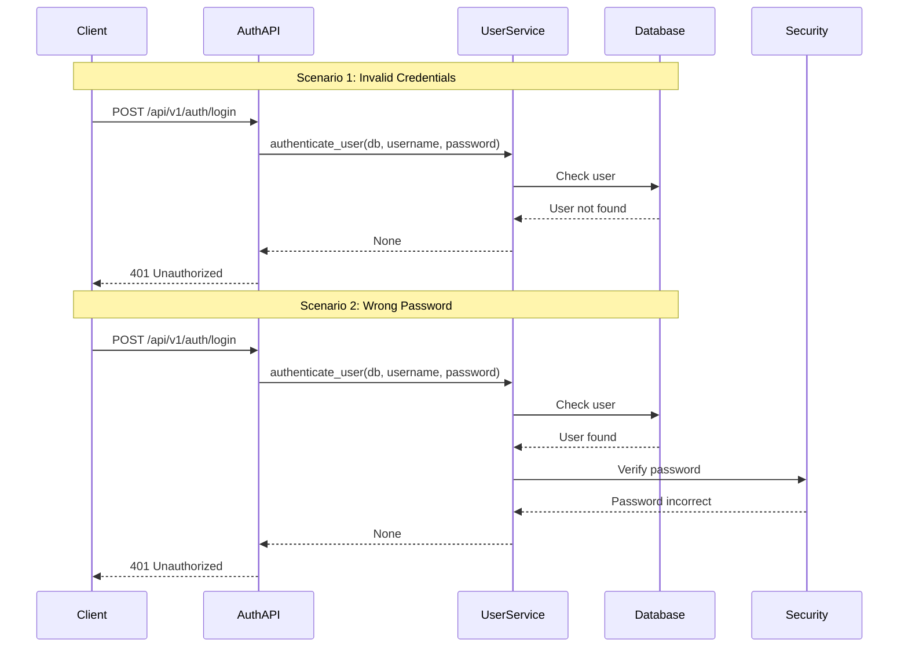

---

## 👤 **3. User Profile Management Flow**

### **Get Current User**

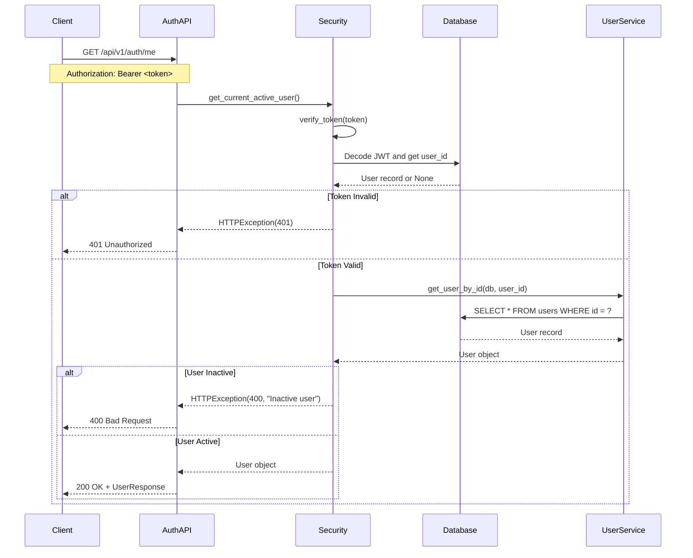

### **Update Current User**

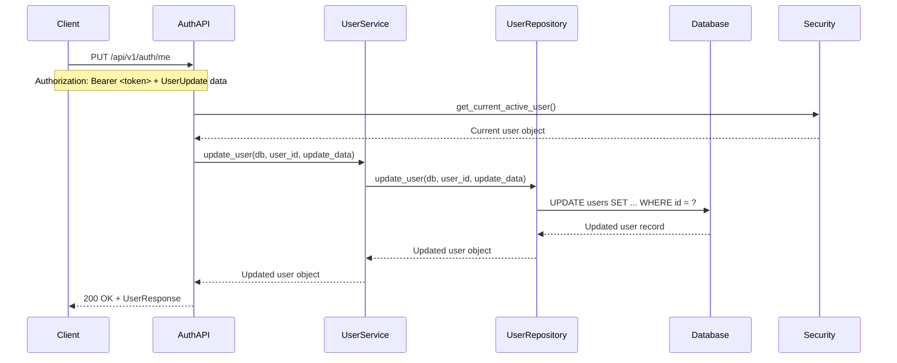

---

## ⚠️ **4. Error Handling Flows**

### **Validation Error Flow**

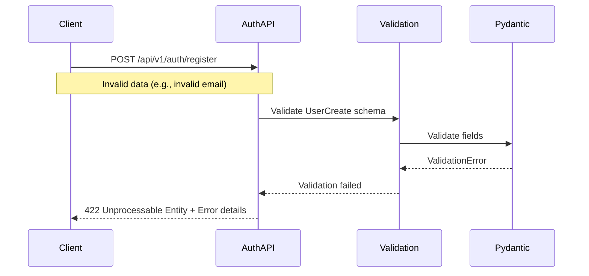

### **Database Error Flow**

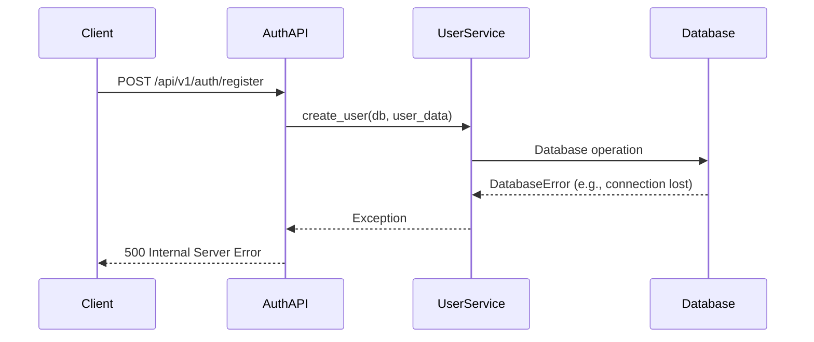

---

## 🌱 **5. Database Seeding Flow**

### **Initial Setup and User Creation**

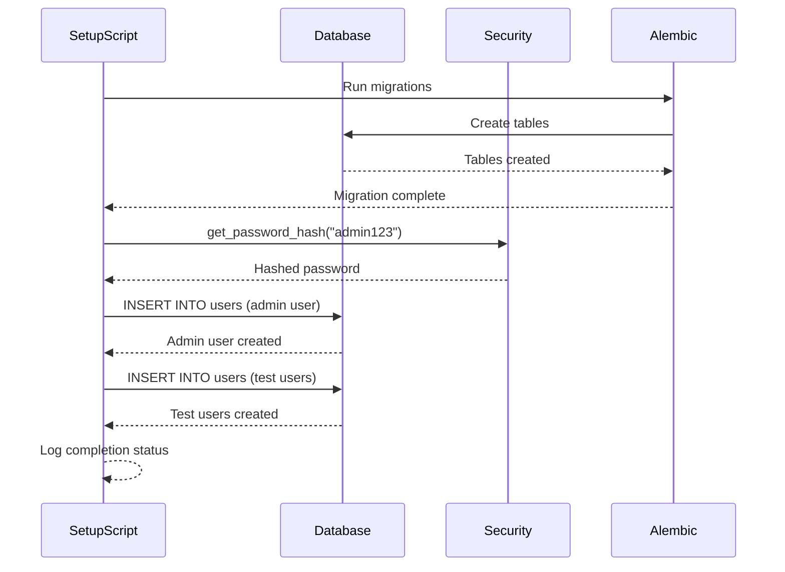

---

## 🔒 **6. Authentication Middleware Flow**

### **Protected Endpoint Access**

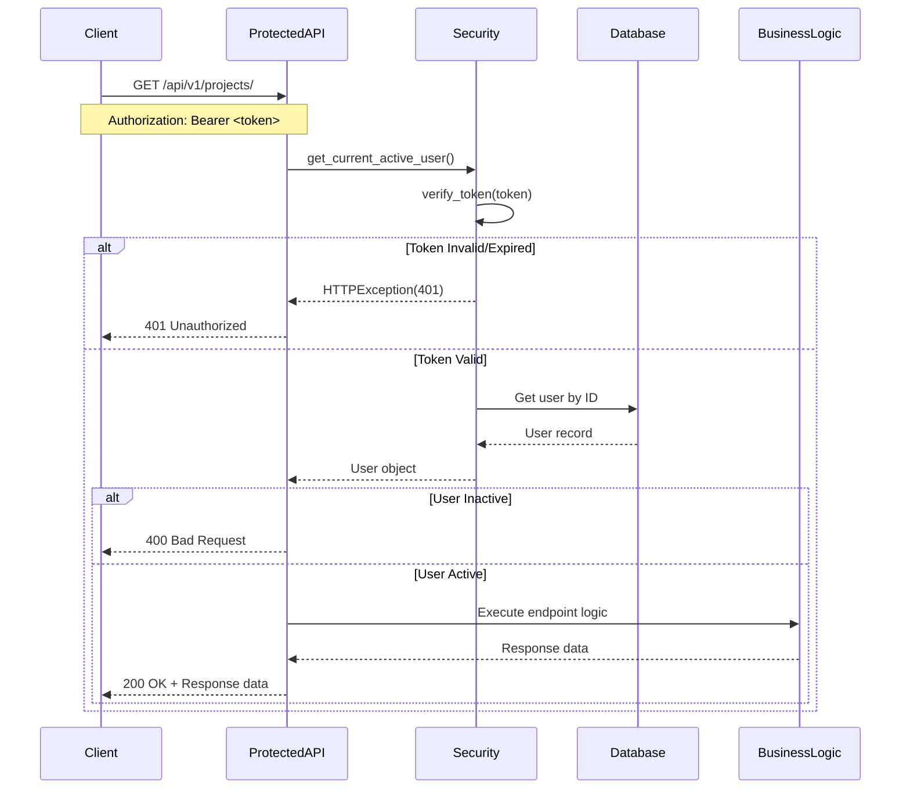

---

## 🏗️ **7. Master Flow Overview**

### **Complete User Management System**

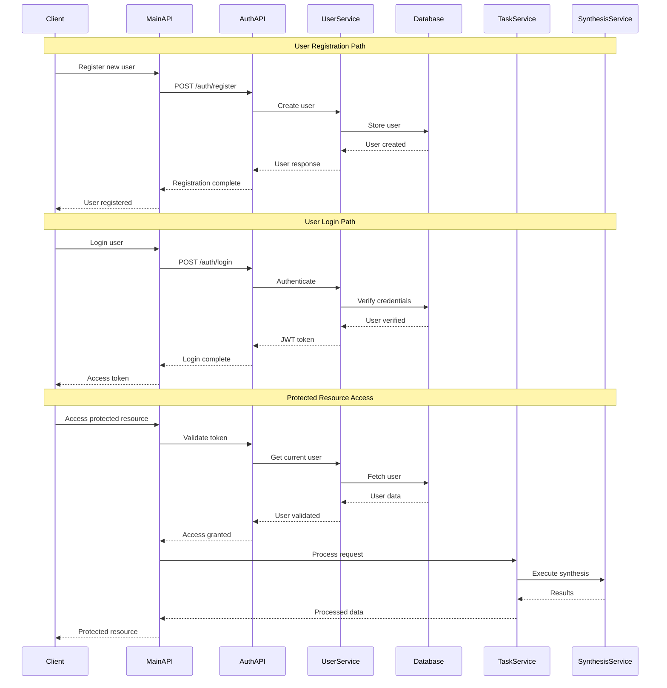

---

## 📊 **8. Multi-Agent vs Single-Agent Flows**

### **Single-Agent Processing Flow**

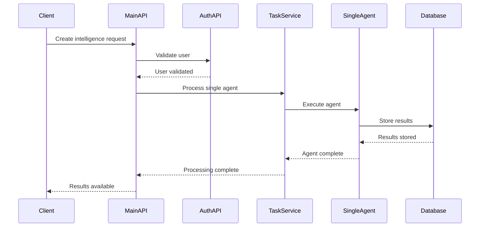

### **Multi-Agent Processing Flow**

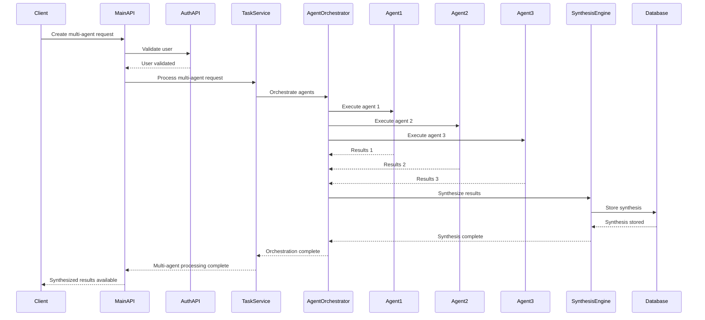

---

## 🔧 **Technical Implementation Details**

### **Key Components:**

1. **Authentication Layer** (`app/core/security.py`)
   - JWT token creation and validation
   - Password hashing with bcrypt
   - User authentication middleware

2. **User Service** (`app/services/user_service.py`)
   - Business logic for user operations
   - User creation and authentication
   - Token generation

3. **User Repository** (`app/repositories/user_repository.py`)
   - Database operations for users
   - User CRUD operations
   - Email and username uniqueness checks

4. **User Model** (`app/models/user.py`)
   - SQLAlchemy user model
   - UUID primary key
   - JSON permissions field

5. **API Endpoints** (`app/api/v1/auth.py`)
   - Registration endpoint
   - Login endpoint
   - User profile endpoints

### **Database Schema:**

```sql
CREATE TABLE users (
    id UUID PRIMARY KEY DEFAULT uuid_generate_v4(),
    email VARCHAR(255) UNIQUE NOT NULL,
    username VARCHAR(100) UNIQUE NOT NULL,
    full_name VARCHAR(255),
    hashed_password VARCHAR(255) NOT NULL,
    is_active BOOLEAN DEFAULT TRUE,
    is_superuser BOOLEAN DEFAULT FALSE,
    permissions JSON DEFAULT '[]',
    created_at TIMESTAMP WITH TIME ZONE DEFAULT NOW(),
    updated_at TIMESTAMP WITH TIME ZONE
);
```

### **Security Features:**

1. **Password Security**
   - bcrypt hashing with salt
   - Password verification
   - Secure password storage

2. **JWT Authentication**
   - HS256 algorithm
   - Configurable expiration
   - Token-based session management

3. **Input Validation**
   - Pydantic schema validation
   - Email format validation
   - Password strength requirements

4. **Error Handling**
   - Comprehensive error responses
   - Security exception handling
   - Database error management

---

## 🎯 **Summary**

This comprehensive workflow covers all aspects of user creation and management in the Pharmaceutical CI Platform:

- **6 distinct flows** identified and diagrammed
- **Error handling** for all scenarios
- **Security considerations** at every step
- **Database operations** clearly mapped
- **Multi-agent vs single-agent** processing differences
- **Complete authentication flow** from registration to protected resource access

The diagrams match the actual codebase implementation and provide a clear understanding for developers with ~2 years of experience. 
