# Pharmaceutical CI Platform: Comprehensive Design Diagrams

## 1. System Architecture Overview

```mermaid
graph TB
    subgraph "External Data Sources"
        CT[Clinical Trials.gov]
        FDA[FDA Database]
        PUB[Scientific Publications]
        NEWS[News & Media]
        REG[Regulatory Filings]
        CONF[Conference Abstracts]
        PAT[Patent Databases]
    end

    subgraph "AWS Cloud Infrastructure"
        subgraph "Ingestion Layer"
            S3_RAW[(S3 Data Lake<br/>Raw Intelligence)]
            COMP[Amazon Comprehend<br/>NLP Processing]
            LAMBDA_ING[Lambda Functions<br/>Data Processing]
        end

        subgraph "AI/ML Processing Layer"
            BEDROCK[AWS Bedrock<br/>AI Reasoning Engine]
            STEP[Step Functions<br/>Workflow Orchestrator]
            EVENT[EventBridge<br/>Event Management]
        end

        subgraph "Multi-Agent Processing"
            AGENT1[🧬 Molecule<br/>Surveillance]
            AGENT2[🧪 Clinical Trial<br/>Intelligence]
            AGENT3[📋 Regulatory<br/>Intelligence]
            AGENT4[📚 Scientific Literature<br/>Intelligence]
            AGENT5[🚀 Commercial Launch<br/>Intelligence]
            AGENT6[💰 Market Access<br/>HTA Intelligence]
            AGENT7[⚠️ Safety<br/>Intelligence]
            AGENT8[📊 Portfolio Planning<br/>Intelligence]
        end

        subgraph "Data & Analytics Layer"
            DDB[(DynamoDB<br/>State Management)]
            SEARCH[OpenSearch<br/>Intelligence Analytics]
            S3_PROC[(S3<br/>Processed Data)]
        end

        subgraph "API & Integration Layer"
            API[API Gateway<br/>REST & GraphQL]
            LAMBDA_API[Lambda Functions<br/>Business Logic]
        end
    end

    subgraph "User Interface Layer"
        WEB[Web Dashboard]
        MOBILE[Mobile App]
        ALERTS[Notification System]
    end

    subgraph "Users"
        EXEC[👔 Executives]
        RND[👨‍🔬 R&D Teams]
        REG_TEAM[📋 Regulatory Affairs]
        COMM[💼 Commercial Teams]
        ANALYST[👩‍💼 Analysts]
    end

    %% Data Flow
    CT --> S3_RAW
    FDA --> S3_RAW
    PUB --> S3_RAW
    NEWS --> S3_RAW
    REG --> S3_RAW
    CONF --> S3_RAW
    PAT --> S3_RAW

    S3_RAW --> LAMBDA_ING
    LAMBDA_ING --> COMP
    COMP --> EVENT

    EVENT --> STEP
    STEP --> BEDROCK

    BEDROCK --> AGENT1
    BEDROCK --> AGENT2
    BEDROCK --> AGENT3
    BEDROCK --> AGENT4
    BEDROCK --> AGENT5
    BEDROCK --> AGENT6
    BEDROCK --> AGENT7
    BEDROCK --> AGENT8

    AGENT1 --> DDB
    AGENT2 --> DDB
    AGENT3 --> DDB
    AGENT4 --> DDB
    AGENT5 --> DDB
    AGENT6 --> DDB
    AGENT7 --> DDB
    AGENT8 --> DDB

    DDB --> SEARCH
    AGENT1 --> S3_PROC
    AGENT2 --> S3_PROC
    AGENT3 --> S3_PROC
    AGENT4 --> S3_PROC
    AGENT5 --> S3_PROC
    AGENT6 --> S3_PROC
    AGENT7 --> S3_PROC
    AGENT8 --> S3_PROC

    SEARCH --> API
    S3_PROC --> API
    API --> LAMBDA_API

    LAMBDA_API --> WEB
    LAMBDA_API --> MOBILE
    LAMBDA_API --> ALERTS

    WEB --> EXEC
    WEB --> RND
    WEB --> REG_TEAM
    WEB --> COMM
    WEB --> ANALYST

    MOBILE --> EXEC
    MOBILE --> RND
    MOBILE --> COMM
    MOBILE --> ANALYST

    ALERTS --> EXEC
    ALERTS --> RND
    ALERTS --> REG_TEAM
    ALERTS --> COMM

    %% Agent Collaboration
    AGENT1 -.->|Molecular Insights| AGENT2
    AGENT2 -.->|Clinical Data| AGENT3
    AGENT3 -.->|Regulatory Status| AGENT5
    AGENT4 -.->|Research Trends| AGENT1
    AGENT7 -.->|Safety Signals| AGENT3
    AGENT8 -.->|Portfolio Gaps| AGENT1
    AGENT8 -.->|Strategic Analysis| AGENT2
    AGENT6 -.->|Market Access| AGENT5

    %% Styling
    classDef awsService fill:#FF9900,stroke:#232F3E,stroke-width:2px,color:#232F3E
    classDef agent fill:#4CAF50,stroke:#2E7D32,stroke-width:2px,color:white
    classDef data fill:#2196F3,stroke:#1565C0,stroke-width:2px,color:white
    classDef user fill:#9C27B0,stroke:#6A1B9A,stroke-width:2px,color:white
    classDef source fill:#FF5722,stroke:#D84315,stroke-width:2px,color:white

    class BEDROCK,STEP,EVENT,DDB,SEARCH,S3_RAW,S3_PROC,COMP,LAMBDA_ING,LAMBDA_API,API awsService
    class AGENT1,AGENT2,AGENT3,AGENT4,AGENT5,AGENT6,AGENT7,AGENT8 agent
    class WEB,MOBILE,ALERTS data
    class EXEC,RND,REG_TEAM,COMM,ANALYST user
    class CT,FDA,PUB,NEWS,REG,CONF,PAT source
```

## 2. Multi-Agent Collaboration Flow

## 3. AWS Services Integration Architecture

## 4. Data Flow and Processing Pipeline

## 5. Agent Interaction and Communication Matrix

## 6. User Role-Based Access and Dashboard Architecture

## 7. Security and Compliance Architecture

## 8. Deployment and CI/CD Pipeline

## 9. Performance and Scaling Architecture

## 10. Disaster Recovery and High Availability

These comprehensive design diagrams provide visual representations of all key aspects of the pharmaceutical CI platform architecture, from high-level system overview to detailed security, performance, and disaster recovery designs. Each diagram serves as a blueprint for implementation and can be used for stakeholder communication, development planning, and operational guidance.
